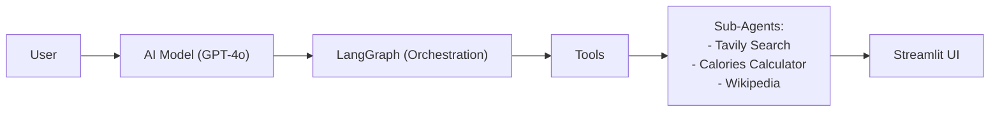

# 🍽️ FOOD AI CHATBOT

**An intelligent AI-powered chatbot that analyzes food images, estimates nutrition, checks dietary restrictions, and explores cultural history.** 

## Features  

### **Food Identification**  
- **AI Vision**: Recognize dishes from photos using GPT-4o  
- **Ingredients**: Detailed breakdown with confidence scores  
- **Cuisine Type**: Classify origin (e.g., Italian, Japanese)  

### **Nutrition Analysis**  
- **Calories**: Estimate per serving  
- **Macros**: Protein, carbs, fat, fiber, and sugar content  
- **Serving Size**: Visual approximation  

### **Dietary Compatibility**  
- **Allergens**: Gluten, nuts, dairy, etc.  
- **Diets**: Vegan/vegetarian, keto, diabetic-friendly checks  
- **Custom Notes**: Add personal dietary preferences  

### **Food Culture & History**  
- **Web Search**: Powered by Tavily API (Wikipedia fallback)  
- **Origins**: Regional variations and evolution of dishes  

### **Smart Conversation**  
- Multi-step queries (e.g., *"Is this healthy for a keto diet?"*)  
- Context-aware follow-ups

---

## 🚀 Quick Start  

### Prerequisites  
- Python 3.8+  
- [OpenAI API key](https://platform.openai.com/api-keys)  
- *Optional*: [Tavily API key](https://tavily.com)  

### Installation  
```bash
git clone https://github.com/Seng-Pan/food-ai-chatbot.git
cd food-ai-chatbot
pip install -r requirements.txt
```

## Configure API Keys

### Create .env file:
```env
OPENAI_API_KEY="your_key_here"
TAVILY_API_KEY="your_key_here"  # Optional
```

### Run the App
```bash
streamlit run main.py
```

## 🛠️ Tech Stack


---

## Usage Examples
1. **Upload a food photo and ask:**
   - "What’s in this dish?"
   - "Is this gluten-free?"
   - "Nutritional info per serving?"
2. **Text queries:**
   - "History of pad thai"
   - "Compare pizza and pasta calories"
  
## Limitations
- Works best with clear, well-lit food images
- Nutrition estimates are approximations
- Requires internet for search features
